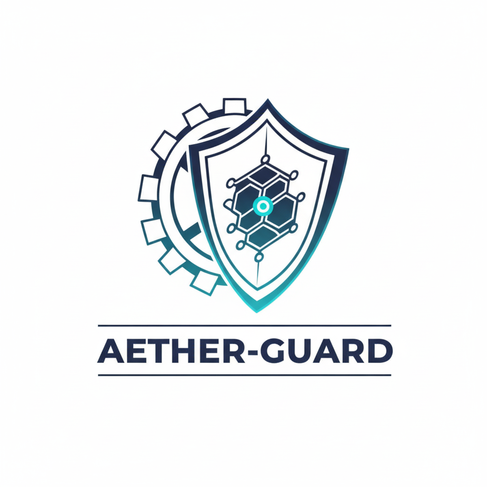

# Aether-Guard v2.2 (Reference Architecture)

[](https://isocpp.org/)
[](https://dotnet.microsoft.com/)
[](https://fastapi.tiangolo.com/)
[](https://nextjs.org/)
[](https://www.postgresql.org/)
[](https://www.docker.com/)

Aether-Guard is a distributed infrastructure monitoring and migration system that
combines a high-performance C++ agent, a .NET Core control plane, a Python AI
engine, and a Next.js dashboard for real-time telemetry and risk-aware recovery.

This README documents the current implementation in this repo (v1.x) and the
v2.2 reference architecture with a concrete implementation guide.

## Project Status

- Stage: MVP implementation in repo; v2.2 is a reference architecture target
- License: MIT
- Authors: Qi Junyi, Xiao Erdong (2026)

## Product Delivery Standard (v2.2)

This project targets a product-grade release, not a demo. The following standards are required for delivery.

### UX Delivery Standard

- Time-to-value (TTFV): first telemetry visible in under 15 minutes.
- One-command deploy, one-command fire drill, one-command rollback.
- Self-check and guidance: CLI/scripts validate dependencies, ports, CRIU/eBPF, and permissions with actionable errors.
- Guided first-run: register agent, receive data, trigger drill, observe migration.
- Explainability: AI risk reason, migration decision, and failures visible in the UI.
- Recovery help: diagnostics bundle export with logs, snapshots, and config.
- Docs-as-product: README, Quickstart, Troubleshooting, FAQ, deploy/upgrade/rollback.

### Engineering Delivery Standard

- Security and trust chain: auth for Agent/Telemetry/Artifact/Command, mTLS with rotation, audit logs, SBOM/SLSA/signing.
- Reliability and resilience: idempotency, retries with backoff, rate limits, circuit breakers, MQ backpressure and DLQ.
- Observability: OpenTelemetry traces/metrics/logs, consistent trace_id, health and readiness probes.
- Deployment and operations: Helm + Compose, config validation, backup/restore, runbooks.
- Data governance: schema registry and compatibility, retention/cleanup, snapshot lifecycle, migrations.
- Compatibility and evolution: API versioning, capability negotiation, deprecation policy.
- Performance and scale: streaming uploads/downloads, capacity baselines, horizontal scaling strategy.

## Current Implementation Snapshot (v1.x)

- Agent (C++): REST/JSON telemetry; CRIU checkpointing with automatic simulation fallback.
- Core API (.NET 8): REST controllers plus gRPC services with JSON transcoding; RabbitMQ ingestion worker with W3C trace context propagation; migration orchestration; PostgreSQL storage.
- Protobuf contracts: shared schemas in src/shared/protos (AgentService + ControlPlane).
- AI Engine (FastAPI): volatility and trend rules; Core currently sends empty spotPriceHistory (see Risk Logic).
- Dashboard (Next.js): telemetry and command visibility with NextAuth credentials.
- Storage: snapshots stored on local filesystem (Docker volume in compose).
- Security: API key for command endpoints; no mTLS, OpenTelemetry, or schema registry yet.

### Productization Gaps (v1.x)

- No self-check tooling, guided onboarding, or diagnostics bundle.
- No end-to-end auth on telemetry or artifacts; no mTLS.
- No OpenTelemetry instrumentation yet (trace context is propagated across RabbitMQ, but spans/metrics/logs are not fully wired).
- No schema registry or compatibility policy for MQ events.
- No object storage or retention policy for snapshots.

## v2.2 Reference Architecture

### 1) Communication and Protocol (Dual-Stack + Trace Context)

- Core API enables gRPC + JSON transcoding so internal traffic uses Protobuf and external clients keep REST/JSON.
- W3C trace context must propagate across HTTP and RabbitMQ by injecting traceparent and tracestate headers.

### 2) Lifecycle and Compatibility (Handshake and Negotiation)

- Agent performs capability probe (kernel, CRIU, eBPF, feature flags) and reports a Capabilities payload at registration.
- Core responds with AgentConfig to enable or disable features based on compatibility and policy.

### 3) Data Governance (Schema Registry + Object Storage)

- RabbitMQ messages use explicit schemas (Avro/Protobuf) with schema_id + payload, plus upcaster logic for old events.
- Snapshots move to object storage (MinIO/S3) with hot, warm, and cold retention policies.

### 4) Security (SPIFFE + SLSA)

- Workload identity uses SPIFFE/SPIRE with short-lived SVIDs; mTLS replaces static certs.
- Supply chain uses SLSA provenance, SBOM, and signed images.

### 5) Resilience (Backpressure + Idempotency)

- RabbitMQ uses QoS prefetch and explicit ack; failures route to DLQ.
- Idempotency keys are required for critical commands; agents cache recent request_ids to avoid re-execution.

### 6) Operations and Extensions (WASM + Runbooks)

- Policy plugins run in Wasmtime with fuel and memory limits.
- Runbook automation triggers scripts and attaches artifacts to alerts.

## v2.2 Implementation Checklist

### Phase 0: Product Readiness

- [ ] Add self-check scripts (agent/core dependencies, ports, permissions).
- [ ] Add first-run guide in the dashboard.
- [ ] Add explainability fields and failure reasons in UI.
- [ ] Add diagnostics bundle export.
- [ ] Expand docs: Quickstart, Troubleshooting, FAQ, upgrade/rollback.

### Phase 1: The Contract

- [x] Enable gRPC JSON transcoding in Core.
- [x] Define Protobuf contracts for Agent/Core APIs.
- [x] Inject W3C trace context into RabbitMQ headers.

### Phase 2: The Handshake

- [ ] Add DetectCapabilities() in the Agent boot sequence.
- [ ] Extend /register to accept Capabilities and return AgentConfig.
- [ ] Introduce SPIRE or cert-manager based certificate rotation.

### Phase 3: The Persistence

- [ ] Deploy MinIO (S3 compatible) for snapshots.
- [ ] Update ArtifactController to stream to S3 SDK.
- [ ] Add SLSA provenance generation in CI.

## Architecture (Current Data Flow)

- Agent (C++) -> Core API (.NET) -> AI Engine (FastAPI) -> Core API -> PostgreSQL -> Dashboard (Next.js)

## Services

- agent-service: C++ telemetry agent with CRIU-based checkpointing (auto-falls back to simulation mode when CRIU is unavailable).
- core-service: ASP.NET Core API for ingestion, analysis, migration orchestration, and data access.
- ai-service: FastAPI service for volatility-based risk scoring.
- web-service: Next.js dashboard with authentication and visualization.
- db: PostgreSQL for persistence.
- rabbitmq: message broker for telemetry ingestion.
- redis: dedup cache for telemetry ingestion.

## Ports

- Core API: http://localhost:5000
- Dashboard: http://localhost:3000
- AI Engine: http://localhost:8000
- PostgreSQL: localhost:5432
- RabbitMQ Management: http://localhost:15672

## Quick Start (Docker)

```bash
docker compose up --build -d
```

Open the dashboard at http://localhost:3000.

If you want to simulate migrations, start at least two agents:

```bash
docker compose up -d --scale agent-service=2 agent-service
```

### First Run Path (Target <=15 minutes)

1. `docker compose up --build -d`
2. Open http://localhost:3000 and log in.
3. Start at least two agents (see command above).
4. Run the fire drill: `python scripts/fire_drill.py start`
5. Confirm the dashboard shows risk state changes and migration activity.

### Fire Drill (Demo Controller)

Trigger a market crash simulation:

```bash
python scripts/fire_drill.py start
```

Reset back to stable:

```bash
python scripts/fire_drill.py stop
```

### Verification Scripts (Demo)

These scripts validate demo flows and can be reused as product readiness checks:

- `verify_blueprint_v1.py`
- `verify_phase2.py`
- `verify_phase3.py`

### Default Login (Development)

- Username: admin
- Password: admin123

Override via environment variables:

- DASHBOARD_ADMIN_USER
- DASHBOARD_ADMIN_PASSWORD

## Configuration

Core API database connection (docker-compose.yml):

- ConnectionStrings__DefaultConnection=Host=db;Database=AetherGuardDb;Username=postgres;Password=password

Core API artifact base URL (docker-compose.yml):

- ArtifactBaseUrl=http://core-service:8080

Dashboard auth (docker-compose.yml):

- AUTH_SECRET=super-secret-key
- AUTH_TRUST_HOST=true

For production, set a strong AUTH_SECRET and use a secret manager.

## API Overview

Core API (Legacy REST - v1):

- POST /api/v1/ingestion - receive telemetry from agent
- GET /api/v1/dashboard/latest - latest telemetry + AI analysis
- GET /api/v1/dashboard/history - last 20 telemetry records (chronological)
- POST /api/v1/market/signal - update market signal file
- POST /api/v1/artifacts/upload/{workloadId} - upload snapshot
- GET /api/v1/artifacts/download/{workloadId} - download latest snapshot

Core API (gRPC + JSON Transcoding - v2):

- POST /api/v2/agent/register
- POST /api/v2/agent/heartbeat
- GET /api/v2/agent/poll
- POST /api/v2/agent/feedback
- POST /api/v2/ingestion
- POST /api/v2/commands/queue
- GET /api/v2/dashboard/latest
- GET /api/v2/dashboard/history

AI Engine:

- POST /analyze - classify telemetry with spotPriceHistory, rebalanceSignal, capacityScore

## Demo Data Files

The demo uses file-based signals that are mounted into containers via docker-compose:

- Core signal: src/services/core-dotnet/AetherGuard.Core/Data/market_signal.json
- AI prices: src/services/ai-engine/Data/spot_prices.json

The fire drill script writes these files and creates the directories if missing.

## Risk Logic (AI)

Risk scoring uses these rules:

- rebalanceSignal=true: CRITICAL (Cloud Provider Signal)
- Trend > 0.2: CRITICAL (Price Spike Detected)
- Volatility > 5.0: CRITICAL (Market Instability)
- Otherwise: LOW (Stable)

Note: The Core API currently sends an empty spotPriceHistory list; wire that data into Analyze requests to drive volatility decisions.

## Data Model

TelemetryRecord persisted to PostgreSQL:

- AgentId
- WorkloadTier
- RebalanceSignal
- DiskAvailable
- CpuUsage (defaults to 0 in the current pipeline)
- MemoryUsage (defaults to 0 in the current pipeline)
- AiStatus
- AiConfidence
- RootCause
- PredictedCpu
- Timestamp (UTC)

For production, add EF Core migrations and a formal upgrade process.

## Development

Dashboard:

```bash
cd src/web/dashboard
npm install
npm run dev
```

Core API:

```bash
cd src/services/core-dotnet/AetherGuard.Core
dotnet restore
dotnet run
```

AI Engine:

```bash
cd src/services/ai-engine
python -m venv .venv
.venv/Scripts/activate
pip install -r requirements.txt
uvicorn main:app --host 0.0.0.0 --port 8000
```

C++ Agent:

```bash
cd src/services/agent-cpp
cmake -S . -B build
cmake --build build
./build/AetherAgent
```

Windows build note: install Visual Studio Build Tools, CMake, Ninja, and NASM, and run the build from a VS Developer Command Prompt.

Note: If CRIU is unavailable (Windows/Docker Desktop), the agent runs in simulation mode and still produces a valid snapshot archive for demo flows.

## Security Notes

- Authentication uses NextAuth Credentials for the MVP; use an external identity provider for production.
- CORS is limited to http://localhost:3000 in development.
- Secrets and credentials must be rotated for any public deployment.

## Contributing

Please read CONTRIBUTING.md for setup, workflow, and PR guidelines.

## License

MIT License. See LICENSE.
