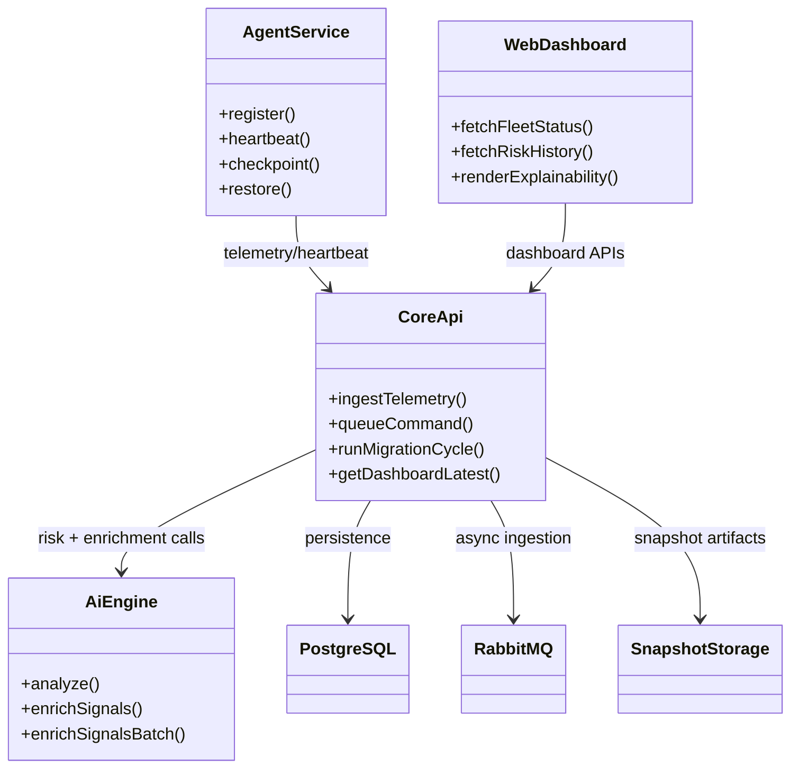
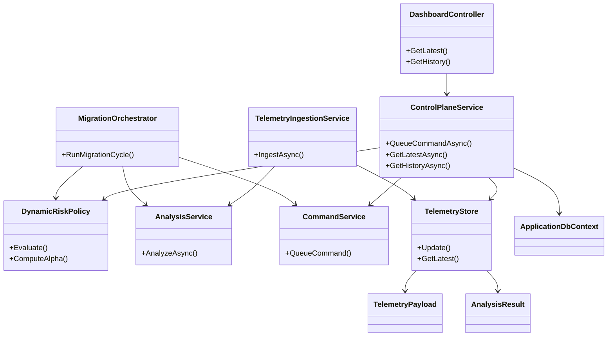
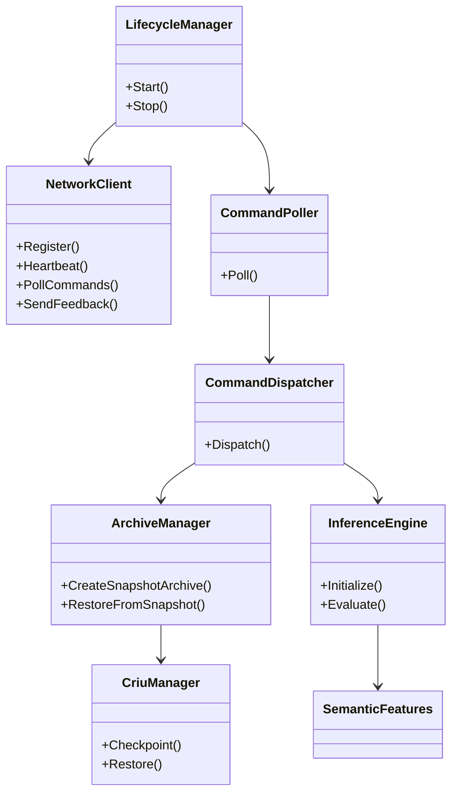
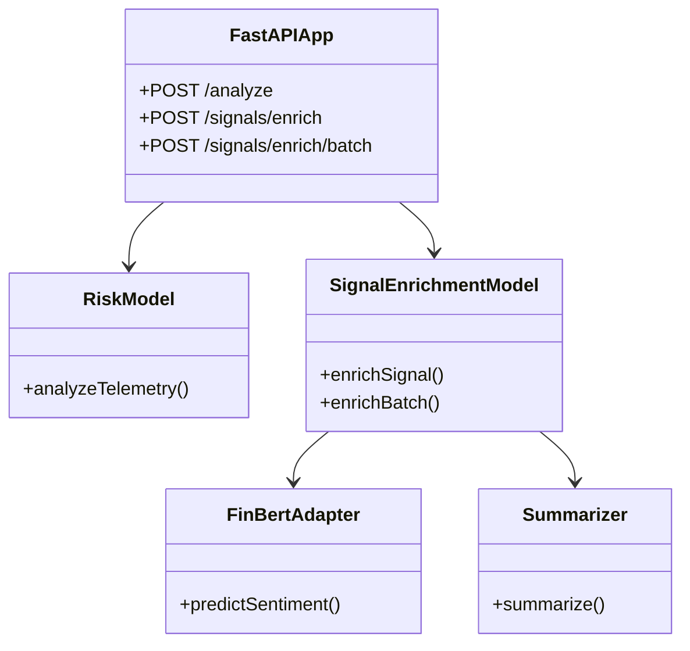
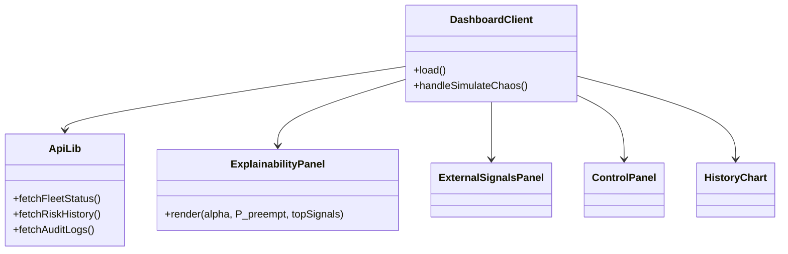

# v2.3 Class Diagrams (Mermaid)

This document provides UML-style class diagrams for the four major service domains:

- Core (.NET)
- Agent (C++)
- AI Engine (Python/FastAPI)
- Web Dashboard (Next.js)

## Cross-Service Overview

## Core (.NET)

## Agent (C++)

## AI Engine (Python / FastAPI)

## Web Dashboard (Next.js)

